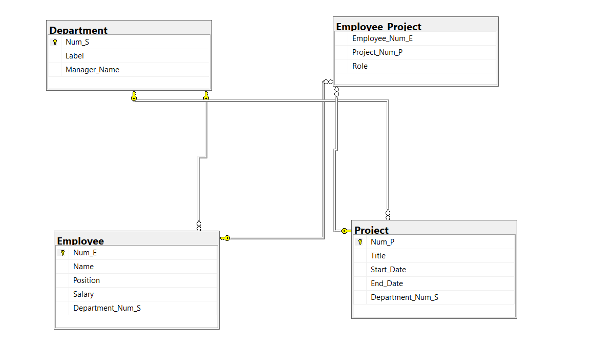

# Database Schema for Checkpoint System

## Overview

This repository contains SQL scripts to create a relational database for a checkpoint management system. The database tracks departments, employees, projects, and the relationships between them.

## Database Structure

The database consists of four main tables:

### 1. Department Table
- `Num_S`: Primary key (department ID)
- `Label`: Department name
- `Manager_Name`: Name of the department manager

### 2. Employee Table
- `Num_E`: Primary key (employee ID)
- `Name`: Employee name
- `Position`: Job position
- `Salary`: Salary amount
- `Department_Num_S`: Foreign key referencing the Department table

### 3. Project Table
- `Num_P`: Primary key (project ID)
- `Title`: Project name
- `Start_Date`: Project start date
- `End_Date`: Project end date
- `Department_Num_S`: Foreign key referencing the Department table

### 4. Employee_Project Table (Junction Table)
- `Employee_Num_E`: Foreign key referencing the Employee table
- `Project_Num_P`: Foreign key referencing the Project table
- `Role`: Employee's role in the project

## Relationships
- Each Department can have multiple Employees (one-to-many)
- Each Department can have multiple Projects (one-to-many)
- Employees can work on multiple Projects, and Projects can have multiple Employees (many-to-many, handled by the Employee_Project junction table)

## Usage

1. Run the SQL script to create the database and tables
2. You can then populate the tables with your data
3. The schema supports queries like:
   - Finding all employees in a department
   - Finding all projects for a department
   - Finding all employees working on a project
   - Calculating department payroll totals

## Future Enhancements
- Add constraints for data validation
- Create indexes for performance optimization
- Add stored procedures for common operations

# Database Schema for Checkpoint System

## Overview

This database schema provides a foundation for tracking organizational structure, employee assignments, and project management.
